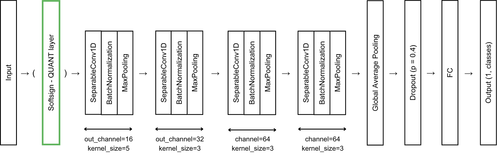

# Towards On-Wearable Human Activity Recognition Deep Learning with Learnable Quantization
Implementing robust Human Activity Recognition (HAR) in always-on wearable scenarios is fundamentally restricted by the
severe energy and memory limitations of low-power sensing platforms. Traditional pipelines worsen these bottlenecks
by relying on high-precision floating-point representations, which increase energy consumption and data throughput. We
address this by investigating non-linear, learnable quantization for efficient on-device HAR. We propose Softsign-QUANT, a hardware-friendly alternative tailored for microcontroller execution.

Evaluation on benchmark HAR datasets demonstrates that 4-bit input quantization preserves activity-relevant information,
achieving macro F1-scores comparable to uncompressed baselines. We further show that shared quantization parameters
across sensor axes are sufficient for HAR, effectively minimizing memory overhead. Our findings establish learnable 4-bit Softsign quantization as a practical, energy-efficient mechanism for deploying deep learning-based HAR on memory-constrained edge architectures.

## Results


## Highlights

- Leave-One-Subject-Out (LOSO) training and evaluation
- Learnable quantization layers:
	- `no`
	- `softsign`
	- `gamma`
	- `linear`
- Shared-axis or per-channel quantization
- Optional Weights & Biases logging
- TFLite post-training quantization export and evaluation

## Repository structure

- `main_loso.py` — LOSO training for UCI-HAR
- `wear_main_loso.py` — LOSO training for WEAR
- `export_loso_tflite_ptq.py` — export trained models to TFLite and evaluate PTQ
- `run_experiments_tflite.sh` — automation script for running multiple experiments
- `lib/model.py` — model and quantization layers
- `lib/train.py` — UCI-HAR dataset and training loop
- `lib/wear_data.py` — WEAR dataset loader
- `lib/wear_train.py` — WEAR training loop
- `models/` — saved checkpoints and exported artifacts
- `log/` — experiment summaries

## Training

### UCI-HAR

Train with the default Softsign quantizer:

```bash
python main_loso.py
```

Other options:

```bash
# No quantization
python main_loso.py --quantization no

# Gamma quantization
python main_loso.py --quantization gamma

# Linear quantization
python main_loso.py --quantization linear

# Per-channel quantization
python main_loso.py --per-channel-quant

# Disable Weights & Biases logging
python main_loso.py --no-wandb
```

### WEAR

```bash
python wear_main_loso.py --quantization softsign --run_name my-run
```

Example variations:

```bash
python wear_main_loso.py --quantization no
python wear_main_loso.py --quantization gamma
python wear_main_loso.py --quantization linear
python wear_main_loso.py --per-channel-quant
python wear_main_loso.py --no-wandb
```

## TFLite post-training quantization

After training, export and evaluate a checkpoint with:

```bash
python export_loso_tflite_ptq.py --dataset uci-har --quantization softsign
python export_loso_tflite_ptq.py --dataset wear --quantization softsign
```

Useful options:

```bash
# Evaluate a specific fold
python export_loso_tflite_ptq.py --dataset wear --subjects 0 --quantization softsign

# Use per-channel checkpoints
python export_loso_tflite_ptq.py --dataset uci-har --per-channel-quant --quantization gamma

# Provide an explicit checkpoint path
python export_loso_tflite_ptq.py --dataset wear --subjects 0 \
	--model-path models/wear/softsign/shared-axis/wear_best_model_loso_val_0.pth
```

Exported TFLite files are written to `models/tflite/` and evaluation summaries are written to `log/`.

## Automation

To run the full experiment pipeline used in the project:

```bash
bash run_experiments_tflite.sh
```

This script trains multiple quantization variants and then exports them to TFLite.

## Outputs

- Best PyTorch checkpoints: `models/`
- Exported TFLite models: `models/tflite/`
- LOSO summaries and PTQ reports: `log/`

## Notes

- By default, the training scripts use Weights & Biases tracking.
- Use `--no-wandb` if you want a local-only run.
- The code is designed for LOSO evaluation, so each fold holds out one subject for validation while using the dataset-specific fixed test split.
